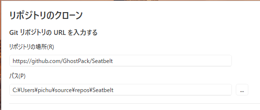
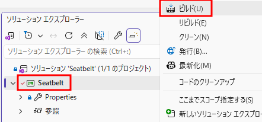

・　作り方

・　Windows Defender（Real Time Protection）を切る<br>
・　gitをインストール
```powershell
PS C:\WINDOWS\system32> winget install --id Git.Git -e
```

・　本家の`.csproj`ファイルを確認、.netはv3.5
```xml
 <TargetFrameworkVersion>v3.5</TargetFrameworkVersion>
```

・　Visual Studio Installer → 「変更」→ 個別のコンポーネントからv3.5をインストール


・　Visual Studioを立ち上げ、リポジトリのクローンから新規作成


・　`Seatbelt`を右クリックしてビルド


・　Seatbelt\bin\などのフォルダに作成されている

・　事後処置  
・　Windows Defenderを戻す。
