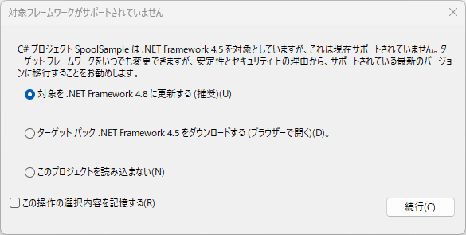
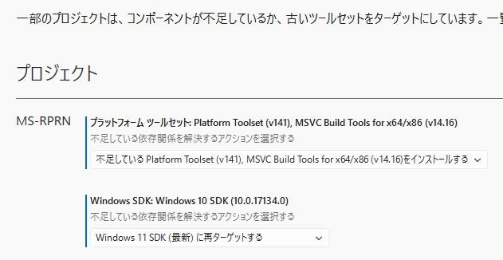
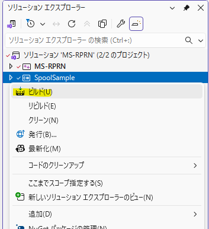

【**SpoolSample.exe**】 🔗 https://github.com/leechristensen/SpoolSample  

・　Windows Defenderを切る（Real Time Protection）

・　管理者権限でPowerShellを実行
```powershell
PS C:\WINDOWS\system32> Set-ExecutionPolicy RemoteSigned -Scope CurrentUser

実行ポリシーの変更
実行ポリシーは、信頼されていないスクリプトからの保護に役立ちます。実行ポリシーを変更すると、about_Execution_Policies
のヘルプ トピック (https://go.microsoft.com/fwlink/?LinkID=135170)
で説明されているセキュリティ上の危険にさらされる可能性があります。実行ポリシーを変更しますか?
[Y] はい(Y)  [A] すべて続行(A)  [N] いいえ(N)  [L] すべて無視(L)  [S] 中断(S)  [?] ヘルプ (既定値は "N"): A
```

・　Visual Studio 2026でSpoolSampleをclone




・　SpoolSampleを右クリックしてビルド  


・　SpoolSample\bin\Releaseなどのフォルダに作成されている

・　事後処置
・　PowerShellのポリシーを戻す
```powershell
PS C:\WINDOWS\system32> Set-ExecutionPolicy Restricted -Scope CurrentUser
```

・　Windows Defenderを戻す
